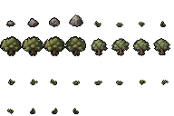

# demo1 — 아이소메트릭 지형·오브젝트 에디터

강·초원·황무지와 바위·나무 지형을 칠할 수 있는 Go/Ebitengine 데모입니다. **32×16픽셀 큰 타일**에 바닥과 장식 종류를 나누어 저장하고, 각 타일을 **16×8픽셀 서브타일 4개**로 그립니다. 지형 경계는 자동으로 연결되며, 잔디·바위는 서브타일 단위, 나무는 큰 타일 하나당 하나씩 배치됩니다.

자료구조, 함수 호출 흐름, ASCII 아키텍처는 [ARCHITECTURE.md](ARCHITECTURE.md)를 참고하세요.

## 실행

저장소 루트에서 실행합니다.

```sh
cd demo1
go run .
```

프로젝트는 [go.mod](go.mod) 기준 **Go 1.26.1**, **Ebitengine v2.10.1**을 사용합니다. 편집기와 실제 창 테스트에는 데스크톱 그래픽 환경이 필요합니다. 첫 실행 시 Go 의존성을 내려받을 수 있습니다.

```sh
# 샘플 지도 열기
go run . -map example-map.json

# 실행 파일 빌드 및 실행
go build -o demo1 .
./demo1

# 실제 편집기 화면을 PNG로 저장하고 종료
go run . -map example-map.json -screenshot editor-preview.png

# 창을 열지 않고 맵 장면만 결정적으로 PNG로 렌더링
go run . -map example-map.json -render map.png -render-scale 4 -render-tick 0
```

이하 명령은 `demo1/` 디렉터리에서 실행합니다. 이미지 에셋은 실행 파일에 포함됩니다. 지도와 내보내기 경로는 실행 시 작업 디렉터리를 기준으로 합니다.

| 옵션 | 기본값 | 설명 |
|---|---|---|
| `-map` | `map.json` | 불러오기·저장에 사용할 JSON 경로 |
| `-screenshot` | 없음 | 편집기 화면을 지정한 PNG로 캡처한 뒤 종료 |
| `-render` | 없음 | 창을 열지 않고 맵 장면만 지정한 PNG로 저장 후 종료 |
| `-render-scale` | `4` | `-render` PNG의 최근접 정수 확대 배율 |
| `-render-tick` | `0` | `-render`의 결정적 애니메이션 tick. 물은 8, 식물은 64 tick 주기 |

지도가 없으면 28×22칸 샘플 맵으로 시작합니다. 파일이 잘못된 경우에도 샘플 맵을 표시하되 상태 표시줄에 오류를 알립니다. **종료 시 자동 저장하지 않습니다.**

## 편집 조작

| 조작 | 기능 |
|---|---|
| `1` | 강 브러시 |
| `2` | 황무지 브러시 |
| `3` | 초원 브러시 |
| `4` | 바위(초원) 브러시 |
| `5` | 바위(황무지) 브러시 |
| `6` | 나무(초원) 브러시 |
| 왼쪽 드래그 | 선택한 지형 칠하기 |
| 오른쪽 드래그 | 황무지로 칠하기 |
| `[` / `]` | 브러시 반경 줄이기 / 늘리기 |
| 마우스 휠 | 커서 기준 정수 배율 확대·축소 |
| Space + 왼쪽 드래그 / 가운데 드래그 | 화면 이동 |
| `F` | 전체 맵 맞춤 |
| `G` | 큰 타일·서브타일 격자 표시 전환 |
| `Z` / `Y` | 되돌리기 / 다시 실행 |
| `S` / `L` | 지정한 JSON 경로에 저장 / 불러오기 |
| `R` | 샘플 맵 복원 |
| `P` | 현재 장면을 `map-export.png`로 내보내기 |

왼쪽 패널의 버튼으로도 지형과 주요 기능을 선택할 수 있습니다. 브러시는 **큰 타일 단위**이며 반경은 0–4칸입니다. 반경 0은 한 칸만 칠합니다. 화면의 `BRUSH` 숫자는 반경에 1을 더한 값입니다.

한 번의 드래그를 하나의 편집으로 기록하며, 되돌리기 기록은 최대 100개입니다. 지도 불러오기와 샘플 복원도 되돌릴 수 있습니다. 파일명 옆의 `*`는 저장이 필요한 편집 상태를 나타냅니다.

커서 아래 큰 타일의 지형과 `Soil`·`Dry` 마스크를 왼쪽 하단에 표시합니다. 마스크 4개의 순서는 **위, 오른쪽, 왼쪽, 아래**입니다. 격자는 큰 타일 경계를 강조하고 서브타일 경계를 얇게 그립니다. 작은 팔레트는 선택한 바닥 지형의 대표 경계를 보여줍니다.

## 큰 타일과 서브타일

큰 타일 하나는 `Cell{Ground, Decoration}`을 저장합니다. 기존 지형 브러시는 두 값을 함께 설정하는 프리셋입니다. 서브타일의 지형이나 마스크를 별도로 저장하지 않고, 주변 큰 타일에서 계산합니다.

| 편집 지형 | 경계 계산에 사용하는 바닥 |
|---|---|
| 강 | 강 |
| 초원 | 초원 |
| 황무지 | 황무지 |
| 바위(초원) | 초원 |
| 바위(황무지) | 황무지 |
| 나무(초원) | 초원 |

큰 타일마다 서브타일에 사용할 3×3 꼭짓점 값을 만듭니다.

- **중앙:** 현재 큰 타일의 바닥 지형.
- **변 중앙:** 변을 공유하는 두 큰 타일의 바닥 중 우선순위가 높은 지형.
- **모서리:** 꼭짓점을 공유하는 네 큰 타일의 바닥 중 우선순위가 높은 지형.

우선순위는 **황무지 > 초원 > 강**입니다. 지도 밖의 칸은 판정에서 제외하므로 가장자리까지 칠한 강은 맵 밖으로 이어집니다. 타일을 칠하면 주변 서브타일의 경계도 즉시 갱신됩니다.

### 경계 마스크와 합성

서브타일마다 두 개의 4비트 마스크를 계산합니다.

| 마스크 | 비트가 1인 조건 |
|---|---|
| `Soil` | 해당 꼭짓점이 황무지 |
| `Dry` | 해당 꼭짓점이 초원 또는 황무지 |

```text
           위: 1
            / \
   왼쪽: 8 <   > 오른쪽: 2
            \ /
           아래: 4
```

마스크 0은 해당 오버레이가 없고, 15는 서브타일 전체를 덮습니다. 1–14는 부분 경계입니다. 렌더링 순서는 **물 → 초원 경계 → 황무지 경계**이며, 전체 초원·황무지는 가려지는 레이어를 생략합니다.

황무지 경계에는 황무지와 젖은 흙만 있고 물색이나 포말은 없습니다. 따라서 같은 오버레이를 물과 초원 위에 재사용합니다. 대각선 혼합은 육지가 중앙에서 연결되고 물은 분리되도록 처리합니다. 공유 변의 경계 함수는 동일한 두 꼭짓점 값에 의존하므로 이웃 서브타일과 일치합니다.

### 화면 좌표

큰 타일의 지도 좌표를 `(u, v)`라고 할 때 투영은 다음과 같습니다.

```text
screenX = (u - v) × 16
screenY = (u + v) × 8
```

서브타일은 지도 좌표 0.5 간격으로 배치합니다. 각 16×8 PNG는 투영한 위쪽 꼭짓점에서 X를 8픽셀 뺀 위치에 그립니다. 마름모의 불투명 행 너비는 `2, 6, 10, 14, 14, 10, 6, 2`이며 빈틈·중복 없이 맞물립니다. 확대에는 최근접 필터와 정수 배율을 사용합니다.

## 오브젝트와 배치 확률

각 큰 타일의 서브타일 4칸마다 **최대 1개의 오브젝트**를 배치합니다. 바위나 나무를 직접 선택해 놓는 방식이 아니라, 큰 타일의 지형 종류에 따라 자동으로 정합니다.



### 종류와 크기

크기는 투명 여백을 제외하고 게임 해상도로 샘플링하는 크기입니다. 외곽선은 가로·세로에 각각 2픽셀을 추가합니다. 잔디는 흔들림을 위해 가로 4픽셀 여백도 사용합니다. 최종 그림은 공통 24×32픽셀 셀에 발밑을 맞춰 넣습니다.

| 오브젝트 | 종류 | 외곽선 추가 전 크기 |
|---|---|---|
| 바위 | 소 / 중 / 중2 / 대 | 8×6 / 11×8 / 10×9 / 14×12 |
| 잔디 | 4종 | 6×5 / 6×4 / 5×5 / 6×5 |
| 나무 | 큰 나무 / 작은 나무 | 22×20 / 20×18 |

모든 오브젝트에는 상하좌우 실루엣을 따라 **1픽셀 검은 외곽선**을 붙입니다. 범용 `spritetool`이 Makefile에 명시된 크기와 외곽선을 적용하고, 게임은 완성된 시트만 읽습니다. 나무는 기존 `tree_0.png`, `tree_1.png`의 4프레임 원본을 사용합니다. 외곽선 여백이 생겨도 발밑 기준점은 유지합니다.

오브젝트는 서브타일 중앙에 발밑을 맞추고 화면 아래쪽에 있는 것이 나중에 그려지도록 정렬합니다. 지형 전체를 먼저 그린 뒤 오브젝트를 그리므로 이웃 바닥이 나무나 바위를 덮지 않습니다.

### 지형별 확률

| 지형 | 나무 | 바위 | 잔디 | 빈칸 |
|---|---|---|---|---|
| 강·황무지 | 없음 | 없음 | 없음 | 100% |
| 초원 | 없음 | 없음 | 총 25% — 4종 각각 6.25% | 75% |
| 바위(초원)·바위(황무지) | 없음 | 총 80% — 4종 각각 20% | 없음 | 20% |
| 나무(초원) | 타일당 1개 — 2종 각각 50% | 없음 | 없음 | 없음 |

표의 확률은 서브타일 기준입니다. 유한한 지도에서 실제 개수가 비율과 정확히 같아지는 것은 아닙니다.

나무(초원)는 **큰 타일 하나에 나무 하나**를 중앙에 배치합니다. 네 서브타일 중 하나를 고르는 방식이 아니며, 나무 종류만 좌표 해시로 균등하게 선택합니다. 나무는 타일 규모의 장식이므로 바위·잔디처럼 서브타일마다 독립 배치하지 않습니다.

### 결정적 의사난수

배치에는 **좌표 해시 기반의 결정적 의사난수(pseudo-random)**를 사용합니다. 큰 타일 좌표, 서브타일 번호, 용도별 스트림 값을 해시해 배치 여부와 종류를 정합니다.

같은 좌표와 지형이면 프레임이 바뀌거나 저장·불러오기·되돌리기를 해도 같은 배치가 나옵니다. 별도 난수 시드나 오브젝트 목록은 저장하지 않습니다. 배치 확률, 종류 선택, 나무 위상에는 서로 다른 스트림을 사용합니다.

## 애니메이션

| 대상 | 프레임 수 | 프레임 간격 | 반복 주기 | 동기화 |
|---|---|---|---|---|
| 물 | 8 | 0.125초 | 1초 | 모든 물 타일이 같은 프레임 사용 |
| 나무·잔디 | 종류별 4 | 2초(1배 기준) | 8초(1배 기준) | 서브타일별 의사난수 위상 |

물은 대비가 낮은 잔물결과 짧은 수평 반사광을 사용합니다. 공간·시간 주기 함수로 이웃 타일의 무늬와 마지막→첫 프레임을 연결합니다. 초원·황무지 바닥과 바위는 애니메이션하지 않습니다. 잔디는 뿌리를 고정하고 잎을 좌우로 흔듭니다. 식물 속도는 UI에서 1/2/4/8배로 변경할 수 있으며 기본값은 2배입니다.

나무와 잔디의 움직임은 `tools/spritetool/assets/`에 저장된 4프레임 원본에 이미 포함되어 있습니다. 빌드 도구는 애니메이션 형태를 만들어내지 않고 프레임을 자르고 크기와 외곽선만 정리합니다. 각 나무에는 **0–7.875초의 시작 위상**을 0.125초 단위로 부여하므로 표시 프레임뿐 아니라 프레임 전환 시점도 분산됩니다. 위상은 좌표로 고정되고, 재실행하면 같은 위상을 가진 애니메이션이 실행 시작 시간을 기준으로 다시 재생됩니다. 현재 재생 시각은 지도에 저장하지 않습니다.

## 저장 형식과 이전 지도 호환

현재 저장 형식은 **버전 5 JSON**입니다. 바닥과 장식을 독립적으로 저장합니다.

```json
{
  "version": 5,
  "width": 3,
  "height": 1,
  "cells": [
    {"ground": 0, "decoration": 0},
    {"ground": 1, "decoration": 1},
    {"ground": 2, "decoration": 2}
  ]
}
```

`cells`는 행 우선 순서이며 인덱스는 `y × width + x`입니다.

| 필드 | 값 |
|---|---|
| ground | 0=강, 1=초원, 2=황무지 |
| decoration | 0=기본 배치, 1=바위, 2=숲 |

기본 배치의 초원에는 기존대로 확률적으로 잔디가 놓입니다. 물 위 바위·숲은 허용하지 않습니다. UI의 기존 6개 브러시는 유지됩니다.

불러올 수 있는 크기는 각각 1–256칸입니다. 셀 배열 길이는 반드시 `width × height`여야 합니다. 경계 마스크, 장식 목록, 애니메이션 시각과 캐시는 저장하지 않습니다. 저장은 임시 파일을 쓴 뒤 대상 파일로 교체합니다.

| 이전 버전 | 입력 데이터 | 변환 |
|---|---|---|
| 1 | `(width+1) × (height+1)`개의 water_vertices | 큰 칸의 물 꼭짓점이 2개 이상이면 강, 아니면 황무지 |
| 2 | `width × height`개의 water_cells | true=강, false=황무지 |
| 3 | terrain_cells의 값 0–2 | 바닥 종류로 변환, 기본 장식 |
| 4 | terrain_cells의 값 0–5 | 기존 프리셋을 바닥·장식으로 분리 |

이전 지도의 크기와 배치를 유지합니다. 불러오기만으로 원본 파일을 수정하지 않으며, 이후 저장하면 버전 5로 기록합니다. `example-map.json`은 버전 4 호환성 샘플로 보존합니다.

## PNG 내보내기

`P`는 현재 물 프레임과 각 나무의 위상을 반영한 장면을 **4배 PNG**로 `map-export.png`에 저장합니다. 편집기 패널과 격자는 포함하지 않습니다. 지도 가장자리 오브젝트가 잘리지 않도록 원본 해상도 기준 사방 최소 16픽셀 여백을 두고, 큰 스프라이트가 범위를 벗어나면 출력 영역을 자동으로 넓힙니다.

`-render`는 Ebitengine 창과 이벤트 루프를 시작하지 않고 동일한 draw list를 소프트웨어로 합성합니다. 같은 지도·에셋·tick이면 PNG 바이트가 같으므로 골든 이미지 기반 통합테스트와 시각적 diff에 사용할 수 있습니다.

```sh
go run . -map example-map.json -render actual.png -render-scale 4 -render-tick 0
cmp testdata/expected.png actual.png
```

`-screenshot`은 패널을 포함한 **실제 편집기 화면**을 저장하는 별도 기능입니다.

```sh
# 실제 편집기 화면 캡처
go run . -map example-map.json -screenshot editor-preview.png
```

## Asset Pipeline

`assets/`에는 게임과 맵 에디터가 직접 읽는 `terrain.png`, `objects.png`,
`catalog.json`만 둡니다. 원본 이미지와 생성 코드는 런타임 패키지에서 분리합니다.

| 경로 | 책임 |
|---|---|
| `assets/` | 실행 파일에 포함되는 최종 에셋만 보관 |
| `tools/tilegenerator/` | 프로젝트의 절차적 지형 규칙으로 `terrain.png` 생성 |
| `tools/spritetool/` | crop, resize, frame slicing, outline, atlas packing을 제공하는 범용 PNG CLI |
| `tools/spritetool/assets/` | 바위·잔디·나무 원본. 애니메이션 오브젝트는 완성된 4프레임을 가로로 보관 |
| `Makefile` | 이 프로젝트의 크기·순서·atlas 배치를 명시하는 빌드 레시피 |

전체 런타임 에셋을 다시 만들려면 다음을 실행합니다.

```sh
make assets
```

개별 도구도 직접 사용할 수 있습니다. `spritetool`은 이미지의 의미를 알지
못하며 ImageMagick `convert`와 비슷하게 입력 옵션만 적용합니다.

```sh
go run ./tools/spritetool \
  --crop 10,20,110,140 \
  --size 22x20 \
  --outline 1 \
  input.png output.png

go run ./tools/spritetool \
  --frames 4 --frame 2 --trim --size 22x20 --outline 1 \
  input-sheet.png output-frame.png

go run ./tools/spritetool \
  --atlas 24x32,8x4 \
  frame-*.png objects.png

go run ./tools/tilegenerator assets/terrain.png
```

`catalog.json`은 셀 번호, 피벗, 애니메이션 이름과 시간을 담는 프로젝트 파일이므로
범용 `spritetool`이 생성하지 않습니다. 지형 시트 순서는 물 8장 → 황무지 1장과
경계 14장 → 초원 1장과 경계 14장입니다.

## 파일 구성

| 경로 | 역할 |
|---|---|
| [ARCHITECTURE.md](ARCHITECTURE.md) | 자료구조, 호출 흐름, 렌더링 아키텍처 |
| [main.go](main.go) | 게임 루프, 입력, 브러시, 편집 이력 |
| [render.go](render.go) | GPU 시트 로딩, 화면 렌더러, 공통 PNG 출력 연결 |
| [editor_render.go](editor_render.go) | 격자·브러시·편집기 UI 표시 |
| [internal/terrain/world.go](internal/terrain/world.go) | 셀 모델, 좌표, 경계 계산, 샘플 맵 |
| [internal/terrain/world_io.go](internal/terrain/world_io.go) | 버전 1–5 호환 로딩과 저장 |
| [internal/terrain/objects.go](internal/terrain/objects.go) | 장식 확률, 배치, 깊이 정렬, 위상 |
| [internal/terrain/scene.go](internal/terrain/scene.go) | 변경 시 갱신하는 맵 캐시와 공통 그릴 목록 |
| [internal/graphics/](internal/graphics/) | 범용 시트 카탈로그, 애니메이션, PNG 렌더러 |
| [tools/tilegenerator/](tools/tilegenerator/) | 프로젝트 전용 절차적 지형 생성기 |
| [tools/spritetool/](tools/spritetool/) | 범용 PNG 스프라이트 가공·atlas 도구와 원본 이미지 |
| [Makefile](Makefile) | 프로젝트별 에셋 제작 순서와 옵션 |
| [assets/](assets/) | 완성된 런타임 시트와 카탈로그만 보관 |
| [example-map.json](example-map.json) | 버전 4 호환 샘플 지도 |

## 검증

```sh
# 로직·에셋·편집 테스트
go test ./...

# 정적 검사와 빌드
go vet ./...
go build .

# 실제 데스크톱 창에서 물·나무 애니메이션과 고정 육지 검사
DEMO1_WINDOW_TEST=1 go test -count=1
```

일반 테스트는 다음 항목을 검사합니다.

- 이진 지형 주변 조합 512가지와 세 바닥 지형 조합 19,683가지.
- 공유 꼭짓점·경계, 강 중심, 고립된 강·수로·합류·대각선·맵 가장자리.
- 마름모 픽셀의 빈틈·중복, 좌표 투영과 큰 타일 선택.
- 생성기의 경계 연속성, 마름모 픽셀 피복, 물의 공간 주기·반복과 고정 육지 레이어.
- 초원·바위 배치 확률과 타일당 나무 1개 조건.
- 오브젝트 지형의 바닥 경계 유지, 깊이 정렬, 1픽셀 검은 외곽선.
- 나무·잔디 4프레임과 뿌리 고정, 위상 분포·전환 시점 분산·주기 반복.
- 캐시 갱신, 바닥·장식 분리, 버전 5 검증, 공통 깊이 정렬과 카탈로그 검증.
- 편집·되돌리기·다시 실행·저장 왕복·이전 버전 변환과 배치 유지.

실제 창 테스트는 일반 테스트와 별도로 실행하는 애니메이션 검증 경로입니다. 문서나 설명만 변경할 때는 에셋 재생성이나 창 실행이 필요하지 않습니다.

현재 범위는 평면 지형 편집과 장식 오브젝트 렌더링입니다. 높이·절벽, 개별 오브젝트 수동 배치, 충돌·이동 경로 계산은 구현하지 않았습니다.
